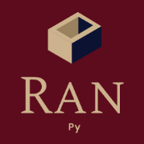

    
  Thanks to Bellshade Project, managed by <a href="http://discord.gg/S4rrXQU"> WPU Discord Community</a> and <a href="https://discord.gg/eavqxxTU"> Kelas terbuka Discord Community</a>  
  WPU Community is the fastest growing software developer forum initiated by <a href="https://www.youtube.com/c/WebProgrammingUNPAS"> Mr. Sandhika Galih</a>  
  

Repositori ini berisi kumpulan berbagai macam _source code_ struktur data, algoritma, analisis matematika, dan sebagainya yang diimplementasikan dengan menggunakan bahasa pemrograman Python.

## 🎉🎉 Selamat Datang di Python 🎉🎉
### Mulai dari [sini](Basic) 🌟

Aur belajar berikut untuk mempelajari dasar - dasar pemograman langsung menggunakan Python

| Langkah |              Topik               |                                  Target Pembelajaran                                  |            Materi Rujukan             |
| :-----: | :------------------------------: | :-----------------------------------------------------------------------------------: | :-----------------------------------: |
|   01    | Introduksi Pemograman dan Python | Memahami apa itu membuat program dan apa peran Python dalam proses pembuatan program  |    [Materi](Basic/01_introduction)    |
|   02    |            Tipe data             |                              Memahami apa itu tipe data                               |     [Materi](Basic/02_tipe_data)      |
|   03    |             Variabel             |                               Memahami apa itu variabel                               |      [Materi](Basic/03_variable)      |
|   04    |             Operasi              | Dapat melakukan operasi sederhana menggunakan program yang ditulis menggunakan Python |      [Materi](Basic/04_operator)      |
|   05    |              String              |                                    Memahami String                                    |       [Materi](Basic/05_string)       |
|   06    |         Input dan Output         |                        Memahami cara mengambil input dari user                        |    [Materi](Basic/06_input_output)    |
|   07    |          Pengkondisian           |  Memahami salah satu dari inti dari membuat pemograman yaitu melakukan pengkondisian  | [Materi](Basic/07_logika_percabangan) |
|   08    |            Perulangan            |            Memahami inti kedua dari pemograman yaitu melakukan perulangan             |     [Materi](Basic/08_perulangan)     |
|   09    |              Fungsi              |                    Mengenal konsep fungsi dalam teknik pemograman                     |       [Materi](Basic/09_fungsi)       |
|   10    |          List dan Tuple          |                    Memahami konsep list dan tuple secara mendalam                     |     [Materi](Basic/10_list_tuple)     |
|   11    |        Manipulasi String         |                       Memahami cara memanipulasi sebuah string                        | [Materi](Basic/11_manipulasi_string)  |
|   12    |            Exception             |                         Memahami konsep exception pada python                         |     [Materi](Basic/12_exception)      |
|   13    |              Module              |                  Memahami cara mengimport sebuah module pada python                   |       [Materi](Basic/13_module)       |
|   14    |             Datetime             |                         Mengenal module datetime pada python                          |  [Materi](Basic/14_python_datetime)   |
|   15    |               Math               |                           Mengenal module math pada python                            |    [Materi](Basic/15_python_math)     |
|   16    |              kelas               |                              Mengenal kelas pada python                               |       [Materi](Basic/16_class)        |

Setelah menyelesaikan seluruh rangkaian pengenalan dasar - dasar pemograman, kalian dapat mulai untuk mempelajari topik - topik lain yang jauh lebih seru!
Untuk sekarang, mulai saja dulu dengan [Object Oriented Programming](object_oriented_programming/README.md)

## 🎓 Topik Lanjutan 🎓

Jika kalian sudah menguasai dasar - dasar pemograman beserta dengan paradigma _Object Oriented Programming_, kalian bisa langsung mengeksplorasi topik - topik lain yang jauh lebih menantang dan tidak kalah seru. Di repositori ini ada beberapa topik yang mungkin kamu suka.

1.  [Struktur Data](/struktur_data)

2.  [Web Programming](/web_programming)

## ⚡ Quick Access ⚡

Semua _script_ yang ada pada repositori ini, dapat diakses dengan cepat lewat link berikut:

- [Basic](Basic/README.md)
- [Algoritma](algorithm)
- [Implementasi](implementation)
  - [Blockchain](implementation/blockchain)
  - [Celular automata](implementation/celular_automata)
  - [Chiper](implementation/chiper)
  - [Compression](implementation/compression)
  - [Electro](implementation/electro)
  - [File transfer](implementation/file_transfer)
  - [Fractal](implementation/fractal)
  - [Geodesy](implementation/geodesy_programming)
  - [Physics](implementation/physics)
- [Web Programming](web_programming)
- [Implementasi Matematika](math)

> "Dengan Bellshade, aku jadi bisa _ngoding_! Terima kasih Bellshade!"

Kami sangat senang bila kalian ingin melakukan kontribusi pada repositori **Python** ini. Tapi, sebelum itu, silahkan baca terlebih dahulu [peraturan dan pedomannya](CONTRIBUTING.md) yang telah kami siapkan. Terima kasih!

Untuk informasi lebih lanjut, mari gabung dalam komunitas [Discord Channel WPU](http://discord.gg/S4rrXQU) dan [Discord Channel Kelas Terbuka](https://discord.gg/eavqxxTU)
